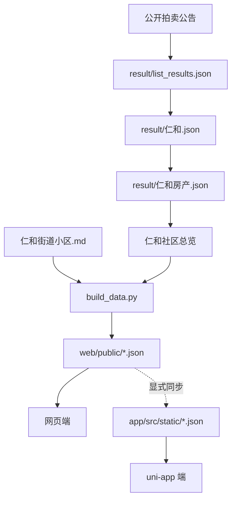

# 数据维护说明

本页说明仓库中已经实现的数据处理链路及安全维护方式。它描述的是当前代码和已归档数据，不承诺来源站点或第三方服务在未来保持相同行为。

## 数据流



`build_data.py` 根据 `仁和街道小区.md` 构建社区映射，并遍历每套房源的 `基础信息.json`，为记录补充 `社区`、`小区名`、`房间号` 三个字段后按 `publish_date` 倒序写入网页端数据。

## 目录与数据职责

| 位置 | 内容 | 使用者 |
| --- | --- | --- |
| `result/list_results.json` | 公开公告列表的原始抓取结果 | 详情抓取脚本 |
| `result/仁和.json` | 公告详情解析结果 | 房产筛选脚本 |
| `result/仁和房产.json` | 关键词筛选后的房产记录 | 详情归档脚本 |
| `仁和社区总览/**/基础信息.json` | 每套已归档房源的结构化来源 | 数据聚合、质量检查 |
| `web/public/community.json` | 社区—小区映射 | 网页端 |
| `web/public/house.json` | 网页端房源聚合数据 | 网页端 |
| `app/src/static/*.json` | 小程序与 H5 构建时内联的静态数据 | uni-app 端 |

## 前端数据更新

在仓库根目录执行：

```bash
python3 build_data.py
```

该命令会覆盖 `web/public/community.json` 和 `web/public/house.json`。网页端因此会读取最新聚合结果。

uni-app 不会在运行时请求网页端的 JSON，而是导入 `app/src/static/` 中的数据。若同一批更新需要进入移动端，应在核对数据条数与字段后同步两份文件：

```bash
# macOS / Linux
cp web/public/community.json app/src/static/community.json
cp web/public/house.json app/src/static/house.json
```

```powershell
# Windows PowerShell
Copy-Item web/public/community.json app/src/static/community.json
Copy-Item web/public/house.json app/src/static/house.json
```

同步后至少分别执行一次网页端和目标 uni-app 端构建。两份 JSON 可以有不同的换行符；应比较解析后的记录数和字段结构，而不是只比较字节内容。

## 维护命令

下列命令均从仓库根目录执行。会改写数据、发起外部请求或消耗第三方服务额度的命令已明确标注。

| 命令 | 作用 | 外部影响 |
| --- | --- | --- |
| `node scripts/stats_check.js` | 统计基础字段、附件、图片和视频的完整度 | 无 |
| `node scripts/parse_house_extra_file_content_value.js` | 扫描大于 10 MiB 的附件，重写 `附件大于10M房源信息.md` | 本地写入 |
| `node scripts/reparse_offline.js` | 依据 `_rawDescText` 重新解析部分基础字段 | 本地写入 |
| `python3 build_data.py` | 重建网页端聚合 JSON | 本地写入 |
| `node scripts/fetch_list.js` | 抓取公告分页列表 | 访问来源站点并重写列表结果 |
| `node scripts/fetch_detail.js` | 解析公告详情，支持跳过已有 URL | 访问来源站点并更新详情结果 |
| `node scripts/filter_property.js` | 按关键词筛选房产记录 | 本地写入 |
| `node scripts/fetch_all.js` | 归档房源详情、附件、图片和视频，并保存进度 | 浏览器自动化、下载与本地写入 |
| `python3 scripts/parse_attachments_mineu.py` | 使用 MineU 将待处理附件转换为 Markdown | 上传附件并消耗外部服务额度 |

`fetch_all.js` 使用 `puppeteer-core`，并在当前实现中查找常见的 Windows Google Chrome 安装路径。它保存 `result/progress_fetch_all.json` 与日志，适合在获得明确授权后的人工维护场景，而不是常规开发验证。

## 抓取与外部服务限制

1. 仅在有权访问、且符合数据来源条款和访问频率要求时运行抓取脚本。
2. 来源站点可能拒绝自动化请求；不要通过规避访问控制、反爬机制或提交浏览器会话信息来“修复”失败。
3. MineU 解析脚本通过环境变量读取 `MINEU_API_KEY`，且依赖 Python `requests` 包。运行前由本地环境安全提供凭据；不要将凭据写入仓库。
4. 附件解析会跳过已有同名 `.md` 文件。修改或删除已解析 Markdown 前，应先确认是否需要重新上传和解析原始附件。

## 建议的本地核对顺序

对于不涉及外部抓取的字段或前端数据更新，可按以下顺序进行：

```bash
node scripts/stats_check.js
python3 build_data.py
cd web && npm run build
```

若移动端也使用更新后的数据，返回根目录完成静态 JSON 同步，再执行所需平台构建：

```bash
cd app && npm run build:h5
# 或 npm run build:mp-weixin / npm run build:mp-alipay
```

## 已知边界

- 仓库未提供后端、实时同步任务、部署配置或公开在线演示地址。
- 前端展示的是聚合 JSON，不会直接浏览 `仁和社区总览/` 中的附件、图片与视频。
- 原始公告格式与第三方链接可能失效，因此结构化字段应视为历史整理结果，并保留原始链接以便人工复核。
